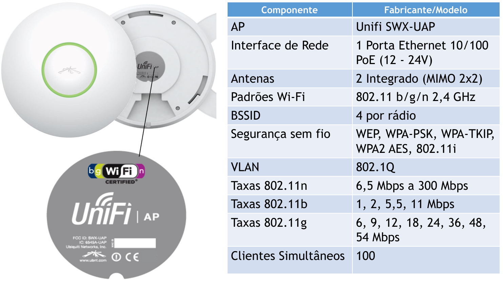
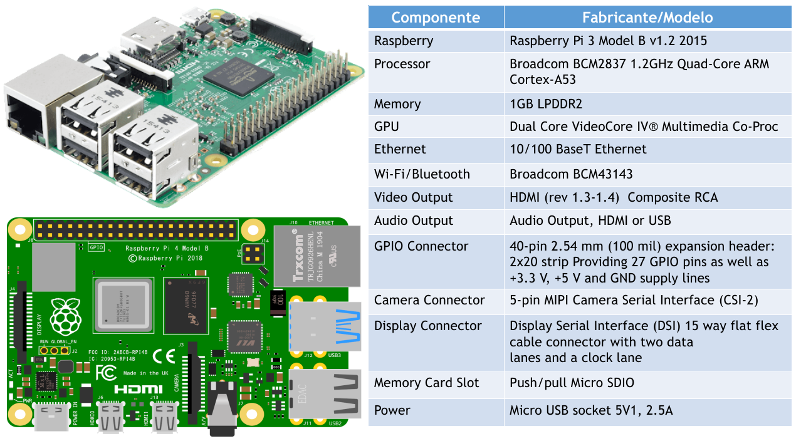

# Curso GRÁTIS de Ubiquiti Unifi para o Sistema Operacional GNU/Linux

## 💰 Ajude o projeto Bora para Prática a continuar fazendo vídeos e materiais gratuitos para o Canal do YouTUBE
## 💰 Chave PIX do projeto: robsonvaamonde@gmail.com
## 💰 Link de doação do PagSeguro: https://pag.ae/bjlSJcH
## 💰 Link de doação do Paypal: https://www.paypal.com/donate/?hosted_button_id=EALLB7DQ3U6H2

Robson Vaamonde 
Procedimentos em TI: http://procedimentosemti.com.br 
Bora para Prática: http://boraparapratica.com.br 
Robson Vaamonde: http://vaamonde.com.br 
Facebook Procedimentos em TI: https://www.facebook.com/ProcedimentosEmTi 
Facebook Bora para Prática: https://www.facebook.com/boraparapratica 
Instagram Procedimentos em TI: https://www.instagram.com/procedimentoem 
YouTUBE Bora Para Prática: https://www.youtube.com/boraparapratica 
Linkedin Robson Vaamonde: https://www.linkedin.com/in/robson-vaamonde-0b029028/ 
Github Procedimentos em TI: https://github.com/vaamonde 

## **Links Oficiais do Ubiquiti Unifi Brasil:**
Site Oficial do Ubiquiti Unifi: https://unifi-network.ui.com/ 
Site Oficial do Unifi Software: https://www.ui.com/download/unifi 
Site Oficial do Unifi ID-SSO: https://account.ui.com 
Blog Oficial do Unifi Brasil: https://medium.com/ubntbr 

Loja Oficial da Ubiquiti Unifi no Brasil: https://br.store.ui.com/ 
Canal Oficial da Ubiquiti Unifi no YouTUBE: https://www.youtube.com/UBNTBR 
Comunidade Oficial da Ubiquiti Unifi no Facebook: https://www.facebook.com/groups/ubnt.unifi.br 
Comunidade Oficial da Ubiquiti Unifi no LinkedIn: https://www.linkedin.com/groups/12135007/

## **Playlist do YouTUBE com todos os Vídeos do Ubiquiti Unifi:**
Link da Playlist: https://www.youtube.com/playlist?list=PLozhsZB1lLUO293mVoY_aqOpMKmTPRQ02

## **Unifi UAP utilizado nos vídeos**

## **📡 COMO instalar o UNIFI CONTROLLER no GNU/Linux Ubuntu Server 18.04.x LTS**

Vídeo mostrando os procedimentos básicos para instalar o Unifi Controller no GNU/Linux Ubuntu Server 18.04 LTS

O software UniFi Controller que vem com o sistema Ubiquiti UniFi tem uma interface baseada em Web que facilita a administração, configuração e gerenciamento dos dispositivos Unifi (Access Point AP, Switch, Router, USG, etc). O sistema Unifi e baseado na arquitetura SDN (Software defined networking) que possibilita o gerenciamento centralizado de todos os equipamentos da infraestrutura da rede utilizando o Unifi Controller Localmente ou Remotamente, ou seja, não há necessidade de configurar individualmente cada um dos dispositivos na rede.

Link da vídeo aula: https://www.youtube.com/watch?v=rrcwiZSBHkg

Link do script utilizado nesse vídeo: https://github.com/vaamonde/ubiquiti-unifi/blob/main/unifi-1804.sh

## **📡 COMO instalar o UNIFI CONTROLLER no DOCKER utilizando o PORTAINER.io**

Vídeo mostrando os procedimentos básicos para instalar e configurar o Unifi Controller no utilizando contêiner Docker e Portainer.io

O software UniFi Controller que vem com o sistema Ubiquiti UniFi tem uma interface baseada em Web que facilita a administração, configuração e gerenciamento dos dispositivos Unifi (Access Point AP, Switch, Router, USG, etc). O sistema Unifi e baseado na arquitetura SDN (Software defined networking) que possibilita o gerenciamento centralizado de todos os equipamentos da infraestrutura da rede utilizando o Unifi Controller Localmente ou Remotamente, ou seja, não há necessidade de configurar individualmente cada um dos dispositivos na rede.

O Docker é uma tecnologia de software que fornece contêineres, ele fornece uma 
camada adicional de abstração e automação de virtualização de nível de sistema operacional no Windows e no Linux.

O Portainer.io uma solução de gerenciamento para o Docker, com ele é possível gerenciar facilmente os seus hosts Docker e clusters com Docker Swarm através de uma interface web limpa, simples e intuitiva.

O Docker Compose é uma ferramenta para definir e executar aplicativos Docker de vários contêineres. Com o Compose, você usa um arquivo YAML (Ain't Markup Language) para configurar os serviços do seu aplicativo. Então, com um único comando, você cria e inicia todos os serviços de sua configuração.

Link da vídeo aula: https://www.youtube.com/watch?v=8tjGFWwpYdI

Link do script utilizado nesse vídeo: https://github.com/vaamonde/ubiquiti-unifi/blob/main/unifi-docker.sh

## **📡 COMO instalar o UNIFI CONTROLLER no GNU/Linux UBUNTU SERVER 20.04.x utilizando o Raspberry Pi 3**

Vídeo mostrando os procedimentos básicos para instalar e configurar o Unifi Controller no GNU/Linux Ubuntu Server 20.04.x LTS ARM x64 utilizando o Raspberry Pi 3.

O software UniFi Controller que vem com o sistema Ubiquiti UniFi tem uma interface baseada em Web que facilita a administração, configuração e gerenciamento dos dispositivos Unifi (Access Point AP, Switch, Router, USG, etc). O sistema Unifi e baseado na arquitetura SDN (Software defined networking) que possibilita o gerenciamento centralizado de todos os equipamentos da infraestrutura da rede utilizando o Unifi Controller Localmente ou Remotamente, ou seja, não há necessidade de configurar individualmente cada um dos dispositivos na rede.

Raspberry Pi é uma série de computadores de placa única do tamanho reduzido, que se conecta a um monitor de computador ou TV, e usa um teclado e um mouse padrão, desenvolvido no Reino Unido pela Fundação Raspberry Pi. Todo o hardware é integrado numa única placa.

Link da vídeo aula: https://www.youtube.com/watch?v=DCToYDsxgyQ

Link do script utilizado nesse vídeo: https://github.com/vaamonde/ubiquiti-unifi/blob/main/unifi-2004-pi.sh

## **📡 COMO INSTALAR o NOVO Unifi Network Application v7.2.x no Linux Mint 20.3**

Vídeo mostrando os procedimentos básicos para instalar e configurar o Unifi Network Application (antigo Unifi Controller) no Linux Mint 20.3 Una x64 Bits.

O software UniFi Network Application (antigo Unifi Controller) que vem com o sistema Ubiquiti UniFi tem uma interface baseada em Web que facilita a administração, configuração e gerenciamento dos dispositivos Unifi (Access Point AP, Switch, Router, USG, etc). O sistema Unifi e baseado na arquitetura SDN (Software defined networking) que possibilita o gerenciamento centralizado de todos os equipamentos da infraestrutura da rede utilizando o Unifi Controller Localmente ou Remotamente, ou seja, não há necessidade de configurar individualmente cada um dos dispositivos na rede.

Link da vídeo aula: https://www.youtube.com/watch?v=yLnSGN_hmkg

Link do script utilizado nesse vídeo: https://github.com/vaamonde/ubiquiti-unifi/blob/main/unifi-mint-20.sh

Link do procedimento no Linux Mint: https://github.com/vaamonde/dell-linuxmint/blob/master/software/16-unifi.md

Link do procedimento no Linux Mint: https://github.com/vaamonde/ubiquiti-unifi/blob/main/unifi-config/Etapa-001-InstalacaoDoUnifiNetworkApplication.txt

## **📡 COMO ADOTAR (Adopt - Adoption) o UAP (Unifi Access Point) no Unifi Network Application v7.2.x **

Vídeo mostrando os procedimentos básicos para adotar (adopt, adoption, adopting) os UAP (Unifi Access Point) no Unifi Network Application v7.2.x (antigo Unifi Controller) rodando no Linux Mint 20.3 Una x64 Bits.

O software UniFi Network Application (antigo Unifi Controller) que vem com o sistema Ubiquiti UniFi tem uma interface baseada em Web que facilita a administração, configuração e gerenciamento dos dispositivos Unifi (Access Point AP, Switch, Router, USG, etc). O sistema Unifi e baseado na arquitetura SDN (Software defined networking) que possibilita o gerenciamento centralizado de todos os equipamentos da infraestrutura da rede utilizando o Unifi Controller Localmente ou Remotamente, ou seja, não há necessidade de configurar individualmente cada um dos dispositivos na rede.

UAP é um Access Point corporativo de teto para Hotéis, Salas de Reunião, Auditório, Teatro ou empresas que precisem de alta performance e equipamentos esteticamente discretos. É um sistema WiFi revolucionário que combina um desempenho estabilidade e um controlador de gerenciamento virtual.

Site Oficial do Ubiquiti Unifi: https://unifi-network.ui.com/ 
Site Oficial do Unifi Software: https://www.ui.com/download/unifi 
Site Oficial do Unifi ID-SSO: https://account.ui.com 
Blog Oficial do Unifi Brasil: https://medium.com/ubntbr 
Canal do YouTUBE Ubiquiti BR: https://www.youtube.com/channel/UCb_mHuP7q75OrckBcNn3p2Q

Download do Wifiman Desktop: https://community.ui.com/releases/WiFiman-Desktop-0-2-2/74d8bc1d-6735-444b-a7fc-0ea2584ccb89 
Download do Ubiquiti Device Discovery Tool Google Chrome: https://chrome.google.com/webstore/detail/ubiquiti-device-discovery/hmpigflbjeapnknladcfphgkemopofig 
Site do Wifiman: http://wifiman.com/ 
Site do SIMET: https://beta.simet.nic.br/ 
Site do SpeedTest: https://www.speedtest.net/pt

Link da vídeo aula: https://www.youtube.com/watch?v=5mUo4ln6_HM

Link do procedimento no Linux Mint: https://github.com/vaamonde/ubiquiti-unifi/blob/main/unifi-config/Etapa-002-AdocaoDos-UAP-Unifi.txt

## **📡 COMO ATUALIZAR (Update) Firmware do UAP (Unifi Access Point) no Unifi Network Application v7.2 **

Vídeo mostrando os procedimentos básicos para atualizar (Update) dos Firmware (software de controle de baixo nível) dos UAP (Unifi Access Point) no Unifi Network Application v7.2.x (antigo Unifi Controller) rodando no Linux Mint 20.3 Una x64 Bits.

O software UniFi Network Application (antigo Unifi Controller) que vem com o sistema Ubiquiti UniFi tem uma interface baseada em Web que facilita a administração, configuração e gerenciamento dos dispositivos Unifi (Access Point AP, Switch, Router, USG, etc). O sistema Unifi e baseado na arquitetura SDN (Software defined networking) que possibilita o gerenciamento centralizado de todos os equipamentos da infraestrutura da rede utilizando o Unifi Controller Localmente ou Remotamente, ou seja, não há necessidade de configurar individualmente cada um dos dispositivos na rede.

UAP é um Access Point corporativo de teto para Hotéis, Salas de Reunião, Auditório, Teatro ou empresas que precisem de alta performance e equipamentos esteticamente discretos. É um sistema WiFi revolucionário que combina um desempenho estabilidade e um controlador de gerenciamento virtual.

Firmware é uma classe específica de software de computador que fornece controle de baixo nível para o hardware específico do dispositivo. O firmware pode fornecer um ambiente operacional padronizado para o software mais complexo do dispositivo (permitindo maior independência de hardware) ou, para dispositivos menos complexos, atuar como o sistema operacional completo do dispositivo, executando todas as funções de controle, monitoramento e manipulação de dados. Exemplos típicos de dispositivos que contêm firmware são sistemas embarcados.

Link da vídeo aula: https://www.youtube.com/watch?v=ercuh2lngt8

Link do procedimento no Linux Mint: https://github.com/vaamonde/ubiquiti-unifi/blob/main/unifi-config/Etapa-003-AtualizacaoDoFirmware-UAP-Unifi.txt

## **📡 COMO ATUALIZAR para NOVA VERSÃO do Unifi Network Application v7.3.x no Linux Mint 20.3**

Vídeo mostrando os procedimentos básicos para atualizar (Update) para a nova Versão do Unifi Network Application v7.3.x (antigo Unifi Controller) rodando no Linux Mint 20.3 Una x64 Bits.

O software UniFi Network Application (antigo Unifi Controller) que vem com o sistema Ubiquiti UniFi tem uma interface baseada em Web que facilita a administração, configuração e gerenciamento dos dispositivos Unifi (Access Point AP, Switch, Router, USG, etc). O sistema Unifi e baseado na arquitetura SDN (Software defined networking) que possibilita o gerenciamento centralizado de todos os equipamentos da infraestrutura da rede utilizando o Unifi Controller Localmente ou Remotamente, ou seja, não há necessidade de configurar individualmente cada um dos dispositivos na rede.

A nova Versão do UniFi Network Application trouxe melhorias nas configurações, correção de vários Bug's e adicionou novos recursos para facilitar a configuração e suporte dos novos dispositivos da Ubiquiti.

Link da vídeo aula: https://www.youtube.com/watch?v=UvDmcAK2SKA

Link do procedimento no Linux Mint: https://github.com/vaamonde/ubiquiti-unifi/blob/main/unifi-config/Etapa-004-BackupUpdate-UnifiNetworkApplication.txt